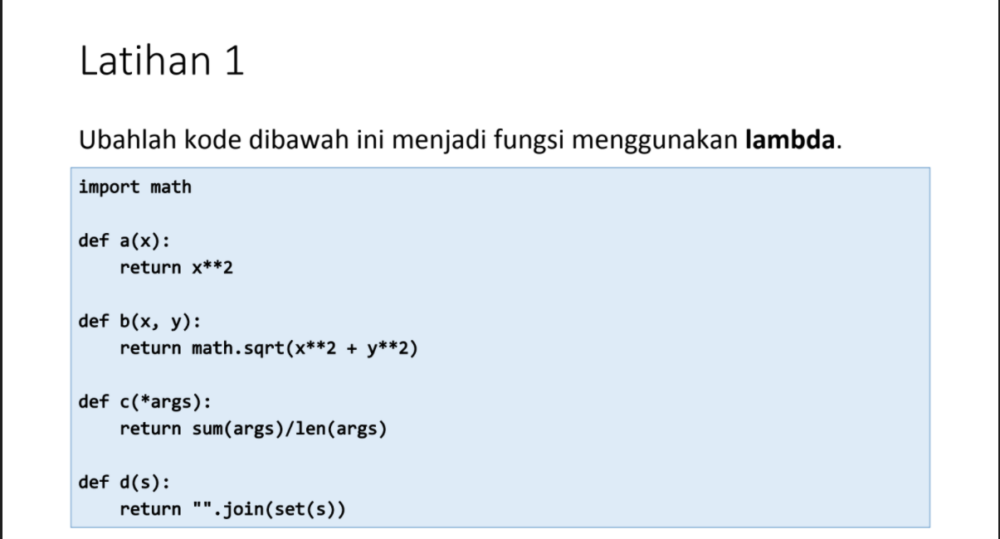

# Praktikum6
## Latihan Lambda
Berikut adalah Latihan menggunakan Lambda
Ubahlah kode dibawah ini menjadi fungsi menggunakan lambda

ini adalah source code nya

Dan ini adalah hasil output nya

Menggunakan import math untuk memperluas daftar fungsi matematika
## Tugas Praktikum 6 (Lambda)
Buat program sederhana dengan mengaplikasikan penggunaan fungsi yang   akan menampilkan daftar nilai mahasiswa, dengan ketentuan:  

Fungsi tambah() untuk menambah data  
Fungsi tampilkan() untuk menampilkan data  
Fungsi hapus(nama) untuk menghapus data berdasarkan nama  
Fungsi ubah(nama) untuk mengubah data berdasarkan nama  
Buatlah flowchart dan penjelasan programnya pada README.md  

Ini adalah source code nya

Dan ini adalah hasil output nya

Penjelasan ada di dalam source code nya 
# Flowchart nya

